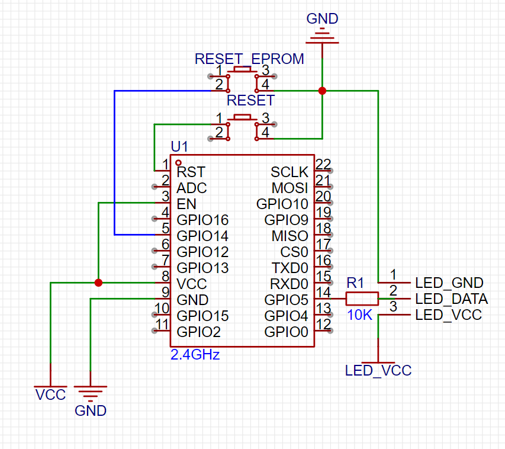

# Smaret Room Project

This project showcases my attempt at creating a smarthome hun and DIY smart devices

The goal that were achived in the project:

* Ability to control various device types with different types of controls from a web UI
* Giving different user ability to control different devices based on permissions

## Running the hub and the web UI

Clone the project

```
$ git clone https://github.com/WazWazTheDeveloper/SmartRoomProject
```

**Using docker**

> this will only work on windows machine as the paths in compose.yaml are not formated correctly for linux

open `compose.yaml` and enter your local ip in the 27th line
```
27: - BACKEND_URL=ENTER YOUR IP HERE
```

then run 
```
$ docker compose up
```

and you will be able to see the web UI at `http://localhost:3000/`

<!-- **From sources** -->

## Device example
open the `client-examples/LedStrip/` folder with platform.io

open `src/settings.h` and set the following:
* `wifi_ssid` - your wifi network name
* `wifi_password` - your wifi network name
* `broker` - your mqtt broker ip(if you are running it locally on your pc enter your local ip address)
* `serverip` - your hub ip(if you are running it locally on your pc enter your local ip address)


assemble the esp according to the schematics:



and upload the firmware to the esp

## Quickstart
open the web UI: `http://localhost:3000/login`

enter `admin` in the username and password field

then click on the settings icon


and then on the `devices` tab

you should be able to see a device named `LedStripExpamle` and have the ability accept, deny and delete it

once you accpet the device you will be able to see and interact with it in main tab(the first icon in the sidebar) 

<!-- ## Creating a device -->


## Project Structure

**Root folder**

Folders:

* `backend` - The smart hub server
* `frontend` - The web ui server
* `client` - Code for esp device
* `client-examples` - Examples for client code

Files:

* `README.md`
* `.gitignore` - Lists files and file masks of the files which should not be added to git repository.
* `SmartRoomProject.code-workspace` - vscode workspace file
* `compose.yaml` - docker file which is used to run the development environment
* `LICENSE` - MIT License, i.e. you are free to do whatever is needed with the given code with no limits.

Client folder structure:

```
Client/Src
|   dataObject.cpp
|   dataObject.h
|   main.cpp
|   pinSettings.cpp
|   settings.h
|   tree.txt
|   
\---dataTypes
        numberData.cpp
        numberData.h
        switchData.cpp
        switchData.h
```

* pinSettings - Used to configurate the pins that are used for controlling different appliances
* settings - This file is used to configurate the inner logic,server ips and some other device settings


## Dependencies

**Backend:**
* [Node](https://nodejs.org) - 20.9.0+
* [Express](https://expressjs.com/) - Used for backend
* [Tailwindcss](https://tailwindcss.com/) - Used insted of traditional css
* [Bcrypt](https://github.com/pyca/bcrypt/) - For password hashing
* [Mqtt](https://github.com/mqttjs/MQTT.js) - Used as the main communication protocol between the hun and the devices
* [Node-cron](https://github.com/node-cron/node-cron) - Used for scheduled tasks and automations 
* [Websocket](https://github.com/websockets/ws) - used for communication with the web ui
* [JWT](https://github.com/auth0/node-jsonwebtoken) - Used for creating session tokens for webui
* [Cookie-parser](https://github.com/expressjs/cookie-parser) - used for parsing JWT cookies
* [date-fns](https://date-fns.org/) - used for logging http requests in the backend

**Frontend:**
* [React](https://react.dev/) - Used for frontend
* [Next.js](https://nextjs.org/) - Used as server renderer for react
* [jwt-decode](https://www.npmjs.com/package/jwt-decode) - Used to decode session tokens
* [headlessui](https://headlessui.com/) - Used for some components
* [flowbite](https://flowbite.com/docs/getting-started/introduction/) - Used for some components
* [mui](https://mui.com/) - Used for icons and some components

**Clients:**
* [Arduino core for ESP8266](https://github.com/esp8266/Arduino) - used as the framework for the esp
* [ArduinoJson](https://arduinojson.org/) - Used to read and create jsons to communicate with the server via the mqtt protocol
* [ArduinoMqttClient](https://github.com/arduino-libraries/ArduinoMqttClient) -  Used to communicate with the server
* [FastLED](https://fastled.io/) - Used to control led strips
* [IRremoteESP8266](https://github.com/crankyoldgit/IRremoteESP8266) - Used to control everything connected to IR leds