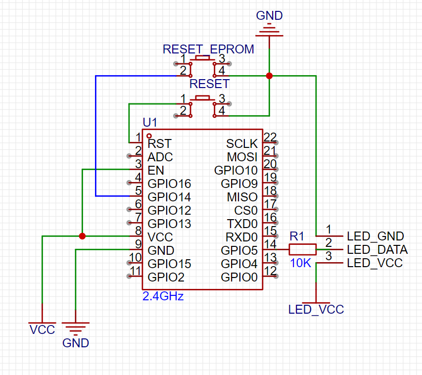

# Smaret Room Project

This project showcases my attempt at creating a smarthome hub and DIY smart devices

The goal that were achived in the project:

-   Ability to control various device types with different types of controls from a web UI
-   Giving different user ability to control different devices based on permissions

## Setup

Clone the project

```
$ git clone https://github.com/WazWazTheDeveloper/SmartRoomProject
```

**Using docker**

> this will only work on windows machine as the paths in compose.yaml are not formated correctly for linux

run `build.bat`

create folder named certs inside `/deployment` and run the following command:
```
$ sudo openssl req -x509 -nodes -days 365 -newkey rsa:2048 -keyout /etc/ssl/private/selfsigned.key -out /etc/ssl/certs/selfsigned.crt
```

then run the following inside `/deployment`

```
$ docker compose up -d
```

after compose finished running run:
```
$ docker run -v deployment_mongo1_config:/db1 -v deployment_mongo2_config:/db2 -v deployment_mongo3_config:/db3 --name helper busybox true
$ openssl rand -base64 756 > mongo-keyfile
$ chown 999 -R mongo-keyfile
$ chmod 600 mongo-keyfile
$ docker cp mongo-keyfile helper:/db1
$ docker cp mongo-keyfile helper:/db2
$ docker cp mongo-keyfile helper:/db3
```
and finally run to initiate the database

```
$ docker exec -it deployment-mongo1-1 mongosh -u admin -p admin 
$ rs.initiate({
    _id: "rs0",
    members: [
        { _id: 0, host: "mongo1", priority: 1},
        { _id: 1, host: "mongo2", priority: 0.5},
        { _id: 2, host: "mongo3", priority: 0.5}
    ]
})
```

and you will be able to see the web UI at `https://localhost/`

<!-- **From sources** -->

## Device example

open the `client-examples/LedStrip/` folder with platform.io

open `src/settings.h` and set the following:

-   `wifi_ssid` - your wifi network name
-   `wifi_password` - your wifi network name
-   `broker` - your mqtt broker ip(if you are running it locally on your pc enter your local ip address)
-   `serverip` - your hub ip(if you are running it locally on your pc enter your local ip address)

assemble the esp according to the schematics:



and upload the firmware to the esp

## Quickstart

open the web UI: `https://localhos:`

enter `admin` in the username and password field
>currently there is no way to add more users or change the admin password from web ui

Open the menu and dlick the devices tab

you should be able to see a device named `LedStripExpamle` and have the ability controll it

<!-- ## Creating a device -->

## Project Structure

**Root folder**

Folders:

-   `accountService` -  Contains user accounts service
-   `authService` - Contains user authentication service.
-   `client-examples` - Contains Code examples for devices.
-   `controllerApiService` - Contains controller API service.
-   `deployment` - Contains deployment files.
-   `deviceControllerService` - Contains the device logic service.
-   `esp8266_client` - Contains Codebase for ESP devices.
-   `frontend` - Contains frontend code.
-   `proxy` - Contains configuration settings for the reverse proxy.
-   `taskControllerService` - Contains the task logic service.

Files:

-   `README.md`
-   `.gitignore`
-   `compose.yaml` - Docker configuration file for setting up the development environment.
-   `LICENSE` - MIT License, i.e. you are free to do whatever is needed with the given code with no limits.

Client folder structure:

```
esp8266_client/Src
|   dataObject.cpp
|   dataObject.h
|   EEPROMFunctions.h
|   globalVariables.h
|   main.cpp
|   mqttFunctions.h
|   pinSettings.cpp
|   settings.h
|   wifiFunctions.h
|
\---dataTypes
        multiStateButtonData.cpp
        numberData.cpp
        switchData.cpp
        multiStateButtonData.h
        numberData.h
        switchData.h
```

-   pinSettings - Configuration for pins that are used for controlling different appliances
-   settings - Configuration for internal logic, server IPs, and additional device settings.

## Dependencies

**Backend:**

-   [Node](https://nodejs.org) - Runtime environment
-   [MongoDB](https://www.mongodb.com/) - Database
-   [Express](https://expressjs.com/) - Backend framework
-   [MQTT](https://github.com/mqttjs/MQTT.js) - Communication protocol used to Communicate with the devices
-   [JWT](https://github.com/auth0/node-jsonwebtoken) - Creating and authenticating session tokens
-   [Node-cron](https://github.com/node-cron/node-cron) - Scheduling tasks and automating recurring processes within the application.
-   [Winston](https://github.com/winstonjs/winston) - Logging

**Frontend:**

-   [React](https://react.dev/) - Frontend frameword
-   [Next.js](https://nextjs.org/) - React framework

**Clients:**

-   [Arduino core for ESP8266](https://github.com/esp8266/Arduino) - Framework for the esp8266
-   [ArduinoJson](https://arduinojson.org/) - Used to read and create jsons to communicate with the server via the mqtt protocol
-   [ArduinoMqttClient](https://github.com/arduino-libraries/ArduinoMqttClient) - Used to communicate with the server
-   [FastLED](https://fastled.io/) - Used to control led strips
-   [IRremoteESP8266](https://github.com/crankyoldgit/IRremoteESP8266) - Used to control everything connected to IR leds
